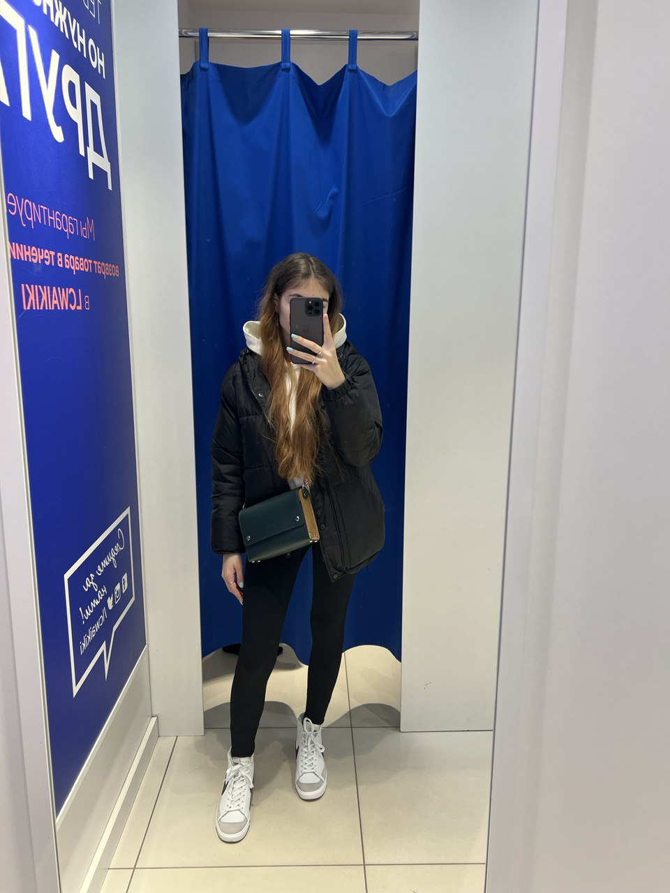

# My CV

Buchmeleva Anastasia  
student of group ASOIR-221

Contacts:  
tepephone: +375447994325  
gmail: [buchmeleva.nastya2004@gmail.com](mailto:buchmeleva.nastya2004@gmail.com)  

---

My goals:

- learn programming
- finish university

---

Education:  
 Place of studying: Belarusian-Russian University  
 Years of studying: 2021-n.d  
 Degree name: Bacalavr

---

Advantages:

- responsibility
- stress resistance

---
My Projects:

- [PNPK](c:\Users\37544\Desktop\programma\ПНПК 5\ПНПК 5.sln)

---

Experience of work:  
none

---

English language:  
A2 level

---

Example of code:

public class Program
{
    public static void Main()
    {
        int[,] matrix = {
            { 1, 2, 3 },
            { 4, 5, 6 },
            { 7, 0, 9 },
            { 10, 11, 12 },
            { 0, 14, 15 }
        };

        int rows = matrix.GetLength(0);
        int columns = matrix.GetLength(1);

        int count = 0;

        // Просмотр каждой строки
        for (int i = 0; i < rows; i++)
        {
            bool hasZero = false;

            // Проверка наличия нулевых элементов в строке
            for (int j = 0; j < columns; j++)
            {
                if (matrix[i, j] == 0)
                {
                    hasZero = true;
                    break;
                }
            }

            // Если строка не содержит нулевых элементов, увеличиваем счетчик
            if (!hasZero)
            {
                count++;
            }
        }

        Console.WriteLine("Количество строк без нулевых элементов: " + count);
    }
}

